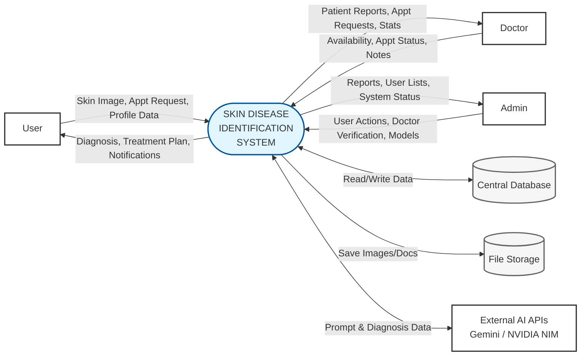
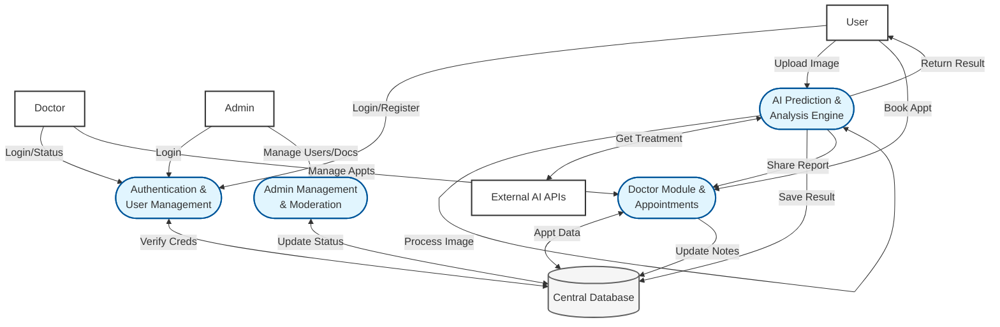
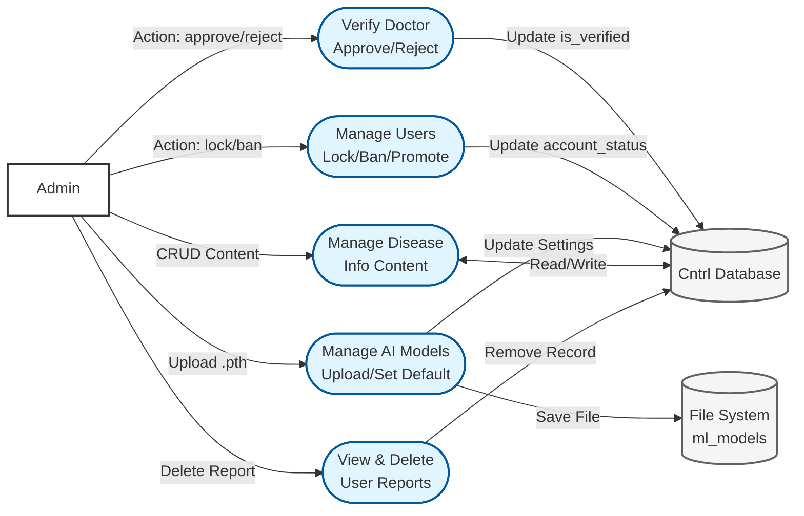
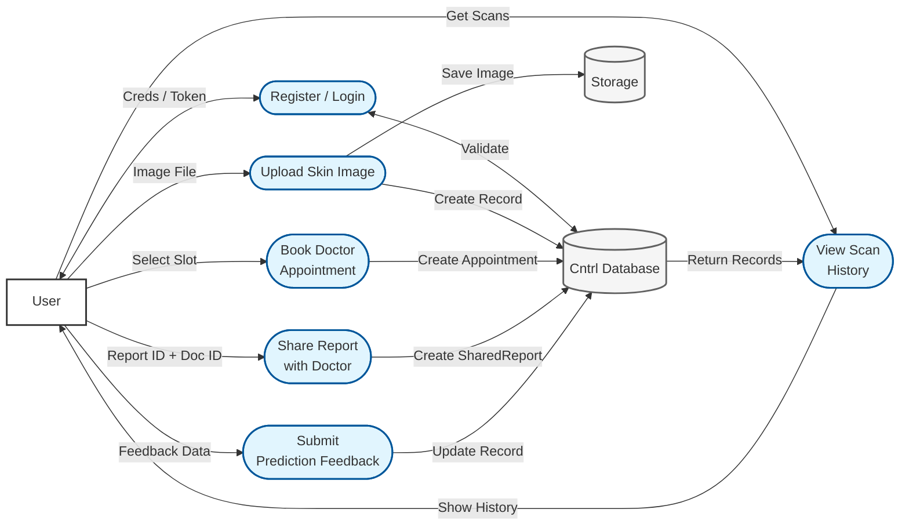
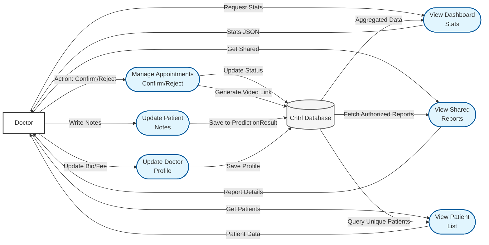
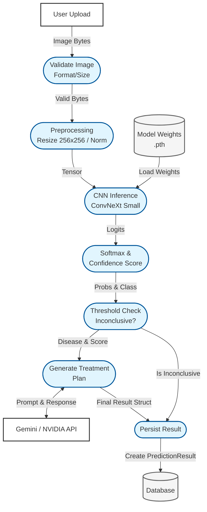

# SkinScan AI - Comprehensive Data Flow Diagrams

These Data Flow Diagrams (DFDs) are strictly derived from the actual code implementation of the SkinScan AI project. They represent the system's current logical architecture.

### **DFD Notation Key**
*   **RECTANGLES [ ]**: External Entities (Actors)
*   **OVALS ([ ])**: Processes (Functions/Logic)
*   **CYLINDERS [( )]**: Data Stores (Database/Storage)
*   **ARROWS -->**: Data Flow

---

## **Level 0: Context Diagram**
*High-level view of the system's boundaries.*

---

## **Level 1: System Overview**
*Breakdown into major subsystems found in the backend structure.*

---

## **Level 2.1: Admin Module**
*Deep dive into `admin_module/views.py` logic.*

---

## **Level 2.2: User Module**
*Deep dive into User-facing features in `authentication` and `prediction`.*

---

## **Level 2.3: Doctor Module**
*Deep dive into `prediction/views_doctor.py` logic.*

---

## **Level 2.4: AI/ML Pipeline**
*Detailed flow of `cnn_inference.py` and `treatment_generator.py`.*

