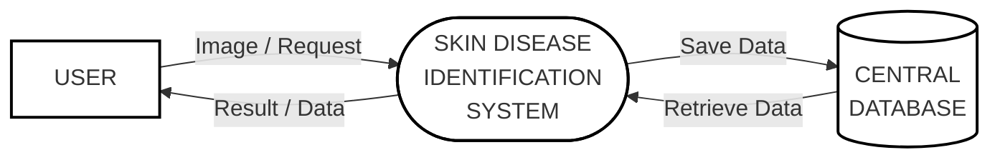

# SkinScan AI - Level 0 Data Flow Diagram

This diagram represents the simplest high-level view of the SkinScan system, focusing solely on the core interaction between the User, the System, and the Central Database.

