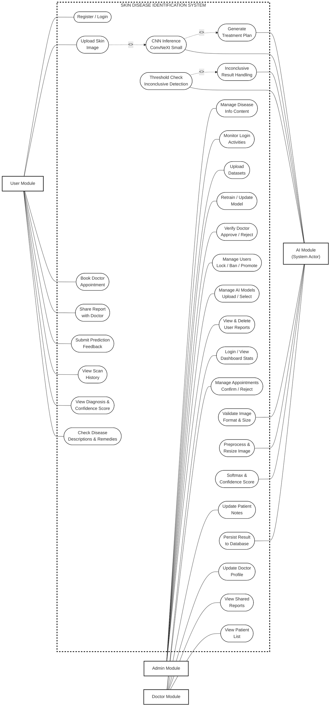

# SkinScan AI - UML Use Case Diagram

This diagram visualizes the functional requirements and interactions of the SkinScan AI system.

```mermaid
graph LR
    %% Actors (External Entities)
    Admin["Admin Module"]
    User["User Module"]
    Doctor["Doctor Module"]
    AI["AI Module<br>(System Actor)"]

    %% System Boundary
    subgraph System ["SKIN DISEASE IDENTIFICATION SYSTEM"]
        direction TB

        %% Admin Use Cases
        UC_A1(["Manage Disease<br>Info Content"])
        UC_A2(["Monitor Login<br>Activities"])
        UC_A3(["Upload<br>Datasets"])
        UC_A4(["Retrain / Update<br>Model"])
        UC_A5(["Verify Doctor<br>Approve / Reject"])
        UC_A6(["Manage Users<br>Lock / Ban / Promote"])
        UC_A7(["Manage AI Models<br>Upload / Select"])
        UC_A8(["View & Delete<br>User Reports"])

        %% User Use Cases
        UC_U1(["Register / Login"])
        UC_U2(["Upload Skin<br>Image"])
        UC_U3(["Book Doctor<br>Appointment"])
        UC_U4(["Share Report<br>with Doctor"])
        UC_U5(["Submit Prediction<br>Feedback"])
        UC_U6(["View Scan<br>History"])
        UC_U7(["View Diagnosis &<br>Confidence Score"])
        UC_U8(["Check Disease<br>Descriptions & Remedies"])

        %% Doctor Use Cases
        UC_D1(["Login / View<br>Dashboard Stats"])
        UC_D2(["Manage Appointments<br>Confirm / Reject"])
        UC_D3(["Update Patient<br>Notes"])
        UC_D4(["Update Doctor<br>Profile"])
        UC_D5(["View Shared<br>Reports"])
        UC_D6(["View Patient<br>List"])

        %% AI Use Cases
        UC_AI1(["Validate Image<br>Format & Size"])
        UC_AI2(["Preprocess &<br>Resize Image"])
        UC_AI3(["CNN Inference<br>ConvNeXt Small"])
        UC_AI4(["Softmax &<br>Confidence Score"])
        UC_AI5(["Threshold Check<br>Inconclusive Detection"])
        UC_AI6(["Generate<br>Treatment Plan"])
        UC_AI7(["Persist Result<br>to Database"])
        UC_Ext(["Inconclusive<br>Result Handling"])

        %% Relationships (Internal Logic)
        UC_U2 -.->|<<include>>| UC_AI3
        UC_AI3 -.->|<<include>>| UC_AI6
        UC_AI5 -.->|<<extend>>| UC_Ext
    end

    %% Left Side Connections (Admin)
    Admin --- UC_A1
    Admin --- UC_A2
    Admin --- UC_A3
    Admin --- UC_A4
    Admin --- UC_A5
    Admin --- UC_A6
    Admin --- UC_A7
    Admin --- UC_A8

    %% Left Side Connections (User)
    User --- UC_U1
    User --- UC_U2
    User --- UC_U3
    User --- UC_U4
    User --- UC_U5
    User --- UC_U6
    User --- UC_U7
    User --- UC_U8

    %% Left Side Connections (Doctor)
    Doctor --- UC_D1
    Doctor --- UC_D2
    Doctor --- UC_D3
    Doctor --- UC_D4
    Doctor --- UC_D5
    Doctor --- UC_D6

    %% Right Side Connections (AI)
    UC_AI1 --- AI
    UC_AI2 --- AI
    UC_AI3 --- AI
    UC_AI4 --- AI
    UC_AI5 --- AI
    UC_AI6 --- AI
    UC_AI7 --- AI
    UC_Ext --- AI
    
    %% Style Definitions
    classDef actor fill:#fff,stroke:#000,stroke-width:2px;
    classDef usecase fill:#fff,stroke:#000,stroke-width:1px;
    classDef system fill:#fff,stroke:#000,stroke-width:3px,stroke-dasharray: 5 5;

    class Admin,User,Doctor,AI actor;
    class UC_A1,UC_A2,UC_A3,UC_A4,UC_A5,UC_A6,UC_A7,UC_A8 usecase;
    class UC_U1,UC_U2,UC_U3,UC_U4,UC_U5,UC_U6,UC_U7,UC_U8 usecase;
    class UC_D1,UC_D2,UC_D3,UC_D4,UC_D5,UC_D6 usecase;
    class UC_AI1,UC_AI2,UC_AI3,UC_AI4,UC_AI5,UC_AI6,UC_AI7,UC_Ext usecase;
    class System system;
```
